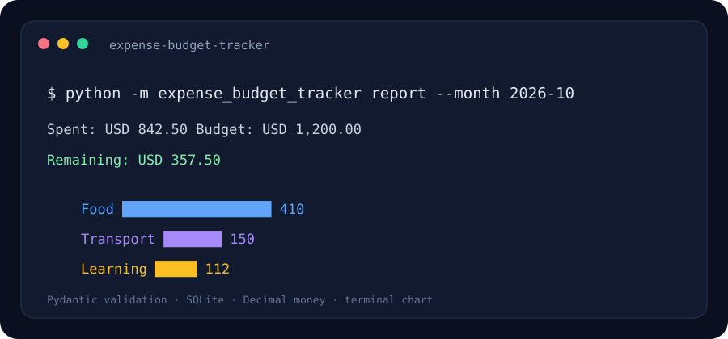

# Minimal Expense & Budget Tracker

A local-first command-line expense tracker with validated transactions, monthly budgets, category totals, and a terminal chart.

> The image above is an illustrative report preview.

## Problem it solves

Small recurring expenses are easy to lose track of. This project keeps records in a local SQLite database, validates input with Pydantic, and compares monthly spending with a chosen budget.

## Quick start

Requires Python 3.10 or later.

~~~powershell
python -m venv .venv
.venv\Scripts\Activate.ps1
python -m pip install -r requirements.txt
python -m expense_budget_tracker add --amount 12.50 --category Food --description "Lunch"
python -m expense_budget_tracker budget --month 2026-10 --amount 600 --currency USD
python -m expense_budget_tracker report --month 2026-10 --currency USD
~~~

The database is created automatically at data/expenses.db. Override it with the EXPENSE_DB_PATH environment variable.

## Commands

- **add** — save a positive amount, category, description, date, and three-letter currency code.
- **budget** — create or update a monthly budget for one currency.
- **report** — show spending by category, the remaining budget, and a text chart.
- **list** — print saved expenses, optionally filtered by month or currency.

Use --no-chart when a plain text summary is preferred.

## Project layout

- **expense_budget_tracker/models.py** — Pydantic expense validation and month parsing.
- **expense_budget_tracker/manager.py** — SQLite persistence and report aggregation.
- **expense_budget_tracker/cli.py** — command parsing and terminal output.
- **assets/preview.svg** — illustrative report preview.

## Tech stack

Python · SQLite · Pydantic · Decimal · plotext

## Data and money notes

All records stay in the local SQLite database and the data directory is ignored by Git. Money is stored as decimal text and limited to two decimal places. Reports are separated by currency so values from different currencies are not combined.

## License

MIT.
